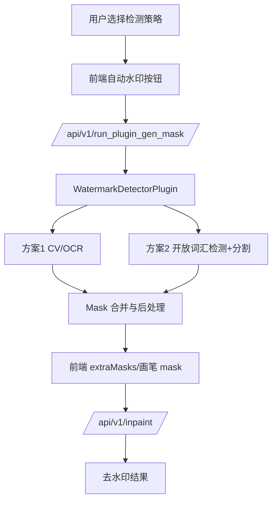

# 技术设计: 自动水印识别与去除

## 技术方案
### 核心技术
- **后端:** Python、FastAPI、OpenCV、NumPy、PIL、PyTorch。
- **方案1:** OpenCV 图像规则 + OCR 可选集成（优先做轻量 OpenCV，OCR 作为可配置增强）。
- **方案2:** 开放词汇检测/分割组合，候选为 Florence-2 或 GroundingDINO + SAM/SAM2；实现时优先选择许可证清晰、依赖可控、可离线缓存的模型。
- **修复:** 复用 IOPaint 现有 `/api/v1/inpaint` 与当前模型管理器。

### 实现要点
- 新增 `WatermarkDetectorPlugin`，实现 `support_gen_mask = True`。
- 插件支持检测模式：`cv_ocr`、`vl_sam`、`combined`。
- 方案1输出候选 mask：OCR 文本框、半透明/边缘/高频规则区域、角标区域等。
- 方案2输出候选 mask：文本提示检测框或初始 mask，再通过分割模型细化。
- 叠加检测使用按像素 OR 合并，再进行形态学后处理。
- 前端自动 mask 应进入现有 `extraMasks`/画笔流程，保持用户可编辑。

## 设计边界
- **范围内:** 水印 mask 自动生成、策略选择、mask 合并后处理、前端入口、现有 inpaint 链路复用。
- **范围外:** 自训练模型、批量处理队列、账号权限、数据库、端到端去水印模型。
- **模块职责:**
  - `iopaint.plugins.watermark_detector`: 负责检测策略编排、mask 生成与后处理。
  - `iopaint.schema`: 负责新增/扩展插件请求参数枚举与字段。
  - `iopaint.api`: 尽量复用现有插件接口，仅在现有请求结构不足时做兼容扩展。
  - `web_app/src/lib/api.ts`: 负责传递检测策略与参数。
  - `web_app/src/lib/states.ts` 和相关组件: 负责触发检测、加载状态、mask 注入和错误提示。
- **接口契约:**
  - 优先复用 `POST /api/v1/run_plugin_gen_mask`。
  - 请求新增可选字段建议：`watermark_mode`、`watermark_prompt`、`watermark_confidence`、`watermark_dilate`、`watermark_max_area_ratio`。
  - 响应仍为 PNG mask，保持前端兼容。
- **数据边界:** 无数据库变更；只处理用户上传图片的内存数据和临时 mask。
- **依赖边界:** 方案1尽量不新增重依赖；方案2依赖必须可选化，避免未启用时影响基础功能启动。
- **大型项目最小改动:** 仅修改插件注册、请求 Schema、前端插件调用与最小 UI；不重构模型管理器、不改现有 inpaint API 行为、不搬迁目录。

## 架构设计

## 架构决策 ADR
### ADR-20260528-001: 以自动生成 mask 复用现有 inpaint 链路
**上下文:** IOPaint 已有成熟的手工 mask 与 inpaint 修复链路，新增水印能力不应重写修复流程。  
**决策:** 水印识别只负责生成 mask，去除步骤继续使用现有 inpaint 模型。  
**理由:** 最小改动、可预览可修正、可复用多种修复模型。  
**替代方案:** 端到端去水印模型 → 拒绝原因: 依赖、许可证、效果稳定性和集成成本更高。  
**影响:** 需要前端支持自动 mask 注入；修复质量依赖用户选择的 inpaint 模型。

### ADR-20260528-002: 同时支持方案1、方案2与叠加检测
**上下文:** 不同水印形态差异大，传统规则和开放词汇模型各有盲区。  
**决策:** 提供三种检测模式：`cv_ocr`、`vl_sam`、`combined`。  
**理由:** 允许用户在速度、成本、召回率之间选择；叠加检测提升多水印场景召回。  
**替代方案:** 只实现单一自动检测 → 拒绝原因: 无法覆盖用户提出的多类型、不固定水印需求。  
**影响:** 参数与 UI 稍复杂；需要明确模型未安装/不可用时的降级策略。

## API设计
### POST /api/v1/run_plugin_gen_mask
- **请求:** 在现有 `RunPluginRequest` 基础上增加可选水印参数：
  - `name`: `watermark_detector`
  - `image`: base64 图片
  - `watermark_mode`: `cv_ocr | vl_sam | combined`
  - `watermark_prompt`: 默认 `watermark, logo, text, signature`
  - `watermark_confidence`: 默认 0.25-0.35，具体实现阶段确定
  - `watermark_dilate`: 默认 8-16 像素，随图片尺寸可缩放
  - `watermark_max_area_ratio`: 防止过大误检，默认 0.35
- **响应:** PNG mask，255 表示需要修复区域，0 表示保留区域。

## 数据模型
无数据库变更。

## 安全与性能
- **安全:**
  - 明确授权使用提示，避免鼓励未授权去除版权水印。
  - 限制最大处理尺寸或对方案2做缩放检测，避免内存耗尽。
  - 对新增请求参数做范围校验，防止异常尺寸、负数阈值等输入。
- **性能:**
  - 方案1应支持 CPU 快速运行。
  - 方案2模型懒加载并缓存，未启用时不阻塞基础服务。
  - 支持先在缩放图上检测，再映射回原图 mask。
  - combined 模式可先执行方案1，方案2失败时保留方案1结果并提示。

## 测试与部署
- **测试:**
  - 后端添加 mask 后处理和模式选择单元测试。
  - 使用简单合成图验证方案1可输出非空 mask。
  - 对方案2抽象模型调用，使用 mock 验证合并逻辑，真实模型作为手工/可选集成验证。
  - 前端验证策略参数传递、按钮状态、mask 注入。
- **部署:**
  - 方案1默认可用。
  - 方案2依赖可选安装；未安装时 UI 或后端返回明确不可用提示。
  - 更新 README/知识库说明依赖、模型下载与授权使用限制。
