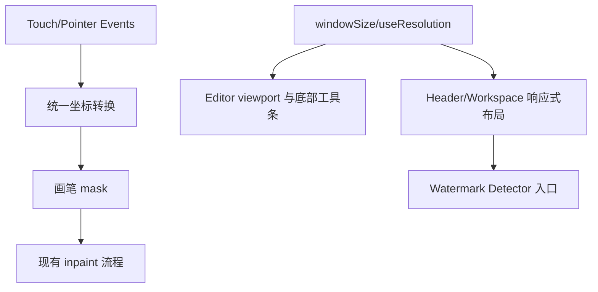

# 技术设计: 移动端显示与操作适配

## 技术方案
### 核心技术
- React + TypeScript + Tailwind 响应式断点。
- 复用现有 `useResolution` / `windowSize` 状态，补充移动端判断。
- 复用 `react-zoom-pan-pinch`，通过配置和模式切换处理触摸绘制与平移冲突。

### 实现要点
- 全局层面补充 `body/#root` 高度、移动端安全区 CSS 变量、`overscroll-behavior` 和必要 `touch-action`。
- Header 在移动端减少间距、允许横向滚动或折叠菜单；PromptInput 使用响应式宽度。
- Workspace 顶部浮动工具在移动端下移/缩小并避开 Header。
- Editor 根据移动端可用高度重新计算 `TOOLBAR_HEIGHT` 或 viewport padding，底部工具条使用 `max-width: calc(100vw - safe-area)` 与横向滚动。
- Settings/SidePanel 中用户可见设置项统一替换为简体中文；技术名词、模型名和枚举值按需保留英文。
- 移动画布事件优先使用 Pointer Events 或统一 mouse/touch 坐标转换，修正 `onTouchEnd` 未触发绘制结束的问题。
- 插件菜单/Dropdown 在窄屏下调整对齐、宽度和触控目标大小。

## 设计边界
- **范围内:** 前端响应式布局、触摸绘制/平移基础可用、移动端控件可见可点、设置项用户可见文案中文化。
- **范围外:** 重新设计整套 UI、后端推理优化、PWA、原生分享/文件系统深度集成。
- **模块职责:**
  - `globals.css`: 全局移动端滚动、高度、安全区和触控基础样式。
  - `Header/Workspace`: 顶部操作区响应式布局。
  - `Editor`: 画布视口、触摸事件、底部工具条。
  - `FileSelect/PromptInput/SidePanel/Settings`: 窄屏弹层和固定宽度调整；Settings 负责设置项中文化。
- **接口契约:** 无 API 变更；前端内部可新增 `isMobile` 辅助判断；不引入运行时 i18n 框架，优先静态替换当前用户可见英文文案。
- **数据边界:** 无数据变更。
- **依赖边界:** 不新增重依赖；优先使用现有 Tailwind、react-use 和 react-zoom-pan-pinch。
- **大型项目最小改动:** 仅改移动端相关组件样式和事件处理，不重构状态管理和修复流程。

## 架构设计

## 架构决策 ADR
### ADR-20260528-003: 以响应式最小改动修复移动端闭环
**上下文:** 当前桌面端功能可用，但移动端显示和触摸交互存在问题。  
**决策:** 不重写编辑器，优先以响应式布局、触摸事件修正和移动端模式提示完成核心闭环。  
**理由:** 风险低、改动小、可快速验证；避免影响已有桌面端。  
**替代方案:** 重建移动端专属编辑器 → 拒绝原因: 成本高、验证周期长。  
**影响:** 移动端体验先达到可用，后续可继续做专属交互优化。

## API设计
无后端 API 变更。

## 数据模型
无数据模型变更。

## 安全与性能
- **安全:** 保留授权图片使用提示；不新增敏感信息处理；移动端上传仍沿用浏览器文件输入；中文化不得弱化版权/授权提示。
- **性能:** 避免在 resize/touchmove 中频繁重渲染；修复 resize 监听清理问题，避免泄漏；不引入大依赖。

## 测试与部署
- **测试:**
  - `npm --prefix web_app run build` 必须通过。
  - 使用浏览器移动端模拟器验证 375×667、390×844、768×1024。
  - 手工验证上传、插件菜单、水印检测、画笔绘制、调整画笔、运行修复、保存/下载。
  - 手工核对设置弹层主要分组和设置项已中文化，且 375px 视口不横向溢出。
- **部署:** 仅前端静态资源变化，按现有 Docker/前端 build 流程发布。
