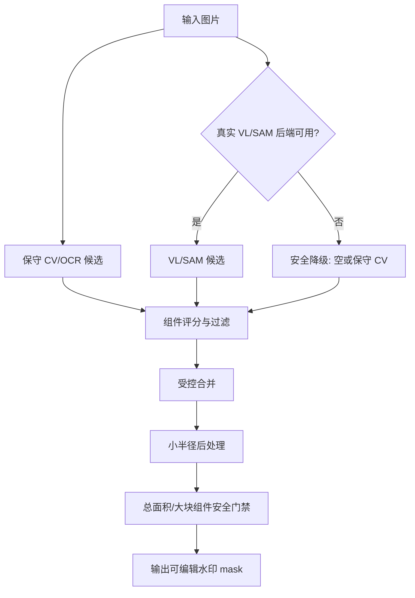

# 技术设计: 水印检测误标人体区域修复

## 技术方案
### 推荐方案: 保守候选过滤 + 安全降级 + 回归测试
以最小改动修复误检来源：不引入新重依赖，不重写插件架构；在现有 OpenCV 检测基础上增加更严格的候选过滤和结果安全门禁，并将 `vl_sam` 无真实后端时的 fallback 改为保守路径。

### 方案对比
#### 方案1: 保守规则修复（推荐）
- **做法:** 调整 `WatermarkDetectorPlugin` 的 fallback、连通域过滤、后处理和默认参数。
- **优点:** 改动小、无需下载模型、CPU 可运行、可快速测试验证。
- **缺点:** 对复杂图案水印召回有限。
- **适用:** 当前误伤人体主体的紧急修复。

#### 方案2: 引入人体/显著主体分割保护
- **做法:** 用人体分割或 saliency 模型先生成主体保护 mask，再从水印候选中扣除。
- **优点:** 人像保护更强。
- **缺点:** 新增模型依赖、下载和 CPU/GPU 成本高，部署复杂。
- **本次结论:** 暂不采用，作为后续增强。

#### 方案3: 接入真实开放词汇检测 + SAM
- **做法:** 用 GroundingDINO/Florence/SAM 做真实“watermark/logo/text”定位分割。
- **优点:** 泛化能力更强。
- **缺点:** 依赖重，环境和模型缓存不稳定，仍需负样本评估。
- **本次结论:** 不作为本次最小修复前提。

## 实现要点
1. **禁用泛化显著性误检路径**
   - 修改 `detect_vl_sam`：当 `_vl_backend` 不存在或失败时，不再调用 Laplacian saliency fallback。
   - 降级为 `detect_cv_ocr` 的保守模式，或返回空 mask 并记录日志。
   - `combined` 在无真实后端时不应比 `cv_ocr` 引入更多自然边缘误检。

2. **增强连通域候选过滤**
   - 在 `_keep_plausible_components` 中新增过滤指标：
     - `bbox_area = w * h`
     - `fill_ratio = area / bbox_area`
     - `aspect = w / h`
     - `component_area_ratio = area / image_area`
     - 可选 `extent_to_border` 或中心区域惩罚。
   - 候选保留原则：更偏向文字/Logo 的细长、低填充率、较小组件；拒绝人体躯干类大块、厚实、高填充组件。
   - 对中心区域、非触边、大面积组件更严格；对角标/边缘水印可适度保留。

3. **收紧默认参数**
   - 后端默认 `watermark_dilate` 从 12 降至 4-6。
   - 前端默认 `watermarkDilate` 同步降低。
   - `watermark_max_area_ratio` 从 0.35 降至更安全值，如 0.08-0.12。
   - 对最终 mask 总面积增加上限，超限时可按组件分数排序保留最可信候选或返回较保守结果。

4. **后处理避免放大误检**
   - 膨胀核随图片尺寸和组件大小自适应，避免小图上 12px 过度扩大。
   - 先过滤再膨胀，膨胀后再次检查总面积比例。
   - 对明显大块连通域做二次剔除。

5. **增加可测试的候选评分函数**
   - 将组件判定逻辑拆成私有 helper，例如 `_is_plausible_watermark_component(...)`。
   - 便于为人体负样本和文字水印正样本写单元测试。

6. **前端默认策略与提示**
   - 默认优先使用 `cv_ocr` 或保守 combined。
   - 菜单文案保留“先预览 mask，确认后再修复”的提示。
   - 不新增复杂 UI，避免扩大范围。

## 设计边界
- **范围内:** 检测插件规则、降级策略、默认参数、测试与文档。
- **范围外:** 新增深度学习检测/分割依赖、训练模型、重写 API、自动直接执行修复。
- **模块职责:**
  - `iopaint/plugins/watermark_detector.py`: 负责检测、候选过滤、合并与后处理。
  - `iopaint/schema.py`: 负责默认值和参数范围。
  - `iopaint/tests/test_watermark_detector.py`: 负责误检回归和正样本回归。
  - `web_app/src/lib/states.ts`: 负责前端默认参数。
  - `web_app/src/components/Plugins.tsx`: 负责最小文案提示（如需要）。
- **接口契约:** 不新增 API；继续使用 `POST /api/v1/run_plugin_gen_mask` 和现有字段。
- **数据边界:** 不保存用户图片；仅内存处理 mask。
- **依赖边界:** 不新增必需依赖；不提交模型权重或缓存。
- **大型项目最小改动:** 仅触达水印检测相关文件，不做无关 UI/架构重构。

## 架构设计

## 架构决策 ADR
### ADR-20260528-004: 水印检测以主体安全优先
**上下文:** 当前水印检测误标人体区域，导致人物主体被后续修复破坏。  
**决策:** 自动检测默认改为保守策略；当真实开放词汇后端不可用时，不再使用泛化显著性算法扩大召回。  
**理由:** 对人物主体的误伤比漏检水印更严重；用户仍可手动补 mask。  
**替代方案:** 继续高召回默认策略 → 拒绝原因: 会破坏用户主体内容，风险不可接受。  
**影响:** 某些复杂水印可能需要手工补充；但自动检测可用性和安全性提升。

## API设计
不新增 API。沿用：
- `POST /api/v1/run_plugin_gen_mask`
- 字段：`watermark_mode`、`watermark_prompt`、`watermark_confidence`、`watermark_dilate`、`watermark_max_area_ratio`

建议默认值：
- `watermark_dilate`: 4 或 6
- `watermark_max_area_ratio`: 0.1
- `watermark_confidence`: 保持 0.35（真实后端可用时再使用）

## 数据模型
无数据库和持久化数据变更。

## 安全与性能
- **安全:** 保持授权图片提示；自动 mask 不应直接执行修复；用户应先预览。
- **性能:** 仍使用 OpenCV/NumPy 轻量规则；新增组件评分为连通域级别，性能影响低。
- **隐私:** 不上传第三方服务；不保存输入图片。
- **回滚:** 可恢复原默认参数和 fallback 逻辑；代码改动集中在插件和默认参数。

## 测试与部署
### 自动化测试
- `pytest iopaint/tests/test_watermark_detector.py -q`
- 新增测试建议：
  1. `test_cv_ocr_does_not_mask_person_like_body_without_watermark`
  2. `test_cv_ocr_detects_text_watermark_without_large_body_region`
  3. `test_vl_sam_without_backend_does_not_use_saliency_body_edges`
  4. `test_post_process_enforces_total_area_safety_limit`

### 前端验证
- `npm --prefix web_app run build`
- 手工验证：人物图片无水印、人物图片带角标/文字水印、普通文字水印图。

### 部署
- 不新增依赖。
- 重新打包 Docker 镜像后验证 `WatermarkDetector` 插件仍可启动。
