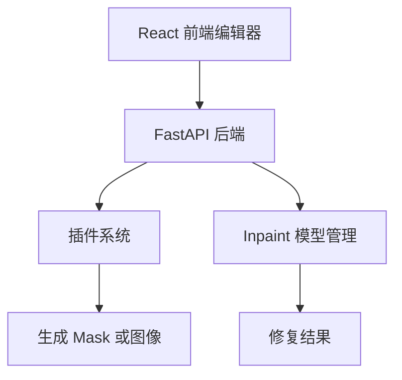
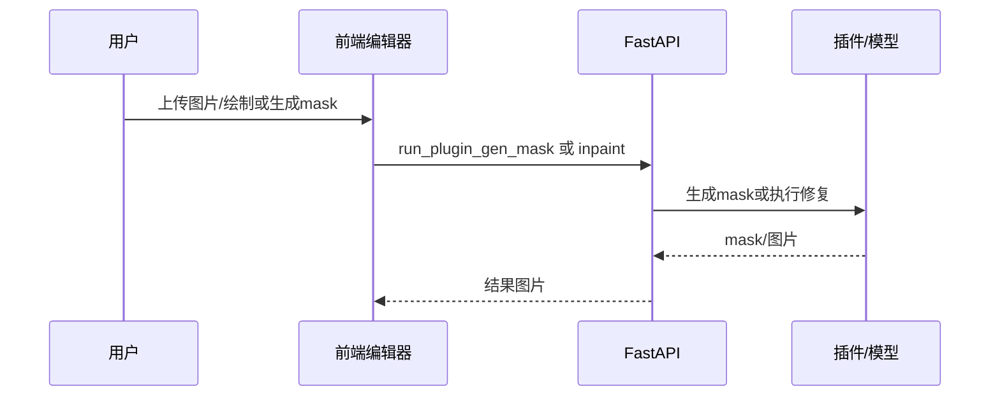

# 架构设计

## 总体架构

## 技术栈
- **后端:** Python、FastAPI、OpenCV、PyTorch、PIL
- **前端:** React、TypeScript、Vite、Zustand
- **数据:** 本地图片文件与内存中图像处理结果，无数据库

## 核心流程

## 重大架构决策
| adr_id | title | date | status | affected_modules | details |
|--------|-------|------|--------|------------------|---------|

| ADR-20260528-001 | 以自动生成 mask 复用现有 inpaint 链路 | 2026-05-28 | ✅已采纳 | 后端插件,前端编辑器 | ../history/2026-05/202605281301_auto_watermark_removal/how.md#adr-20260528-001-以自动生成-mask-复用现有-inpaint-链路 |
| ADR-20260528-002 | 同时支持方案1、方案2与叠加检测 | 2026-05-28 | ✅已采纳 | 后端插件,前端编辑器 | ../history/2026-05/202605281301_auto_watermark_removal/how.md#adr-20260528-002-同时支持方案1方案2与叠加检测 |

## 重大架构决策

| ADR | 决策 | 链接 |
|-----|------|------|
| ADR-20260528-003 | 以响应式最小改动修复移动端闭环 | [how.md](../history/2026-05/202605281335_mobile_adaptation/how.md#adr-20260528-003-以响应式最小改动修复移动端闭环) |
| ADR-20260528-004 | 水印检测以主体安全优先 | [how.md](../history/2026-05/202605281416_watermark_false_positive_fix/how.md#adr-20260528-004-水印检测以主体安全优先) |
